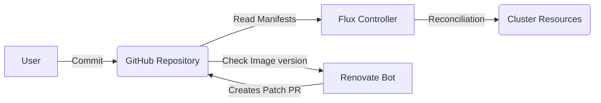

# Kubernetes GitOps Monorepo

## Overview

This repository acts as the **Single Source** of Truth for my Kubernetes infrastructure. It utilises **GitOps principles** to manage the cluster state, infrastructure, and application lifecycles.

I'm using Kubernetes to run my products on a cheap VPS. But not because it needs to scale — but because it's **super practical**.

Whenever I hear people say **"Kubernetes is overkill"** they always talk about it from a **"scale" perspective**.

**My reasons:** I want staging/sandbox + production environments, and I want a **smooth deployment process**.

I push to a branch on GitHub, a pipeline starts, **new code is deployed**, old code is gracefully shut down, traffic is pointed over.

**Just like with a PaaS**.

Kubernetes + Kustomize does this super well! **This would be hell to automate with just docker and various manual scripts....**

But of course, you can **overengineer just about anything** and ramp up cost... That isn't specific to Kubernetes.

Kubernetes can be just about **as simple as you want it to**. I think this is misunderstood.

The project is aligned with [The Twelve-Factor App](https://12factor.net/) methodology.
---


## Core Technology Stack

This project leverages the following technologies to ensure scalability, security, and automation:


| Technology | Purpose | Why? |
|------------|---------|------|
|  | Lightweight Kubernetes | Production-ready Kubernetes that runs on minimal resources |
|   | GitOps Operator | Automatically syncs cluster state with Git repository |
|  | Package Manager | Standardized application deployments with templating |

### Security & Secrets

| Technology | Purpose | Why? |
|------------|---------|------|
|  | Secret Encryption | Encrypt secrets at rest in Git |

### Networking & Access

| Technology | Purpose | Why? |
|------------|---------|------|
|  | Ingress Controller | Dynamic routing and automatic SSL |
|  | Secure External | Zero-trust network access without opening ports |

### Observability

| Technology | Purpose | Why? |
|------------|---------|------|
|  | Metrics Collection | Industry-standard monitoring system |
|  | Visualization | Beautiful dashboards for cluster metrics |

### Automatic upgrades

| Technology | Purpose | Why? |
|------------|---------|------|
| | Dependency | Automated PRs for keeping dependencies update |

### Database

| Technology | Purpose | Why? |
|------------|---------|------|
|  | Database + Backup | PostgreSQL backup via **Barman** to S3 object store with periodic automatic snapshots |


---

## Architecture & Workflow

Changes to the infrastructure are automatically reconciled by Flux every 10 minutes (configured in clusters/staging/flux-system/gotk-sync.yaml) by synchronising with the Git repository.


## Repository Structure

The repository is structured in conformity with the [monorepo](https://fluxcd.io/flux/guides/repository-structure/) methodology.
```
├── apps/
│   ├── base/
│   │   ├── 
│   │   ├── 
│   │   └── 
│   └── staging/
│       ├──
│       ├── 
│       └── 
├── clusters/
│   └── staging/
│       ├── flux-system/
│       ├── apps.yaml
│       ├── infrastructure.yaml
│       ├── monitoring.yaml
│       └── operator.yaml
├── infrastructure/
│   ├── base/
│   │   ├── cloudflare-tunnel/
│   │   ├── flux-image-automation/
│   │   └── renovate/
│   └── staging/
│       ├── cloudflare-tunnel/
│       ├── flux-image-automation/
│       └── renovate/
├── monitoring/
│   ├── base/
│   │   └── kube-prometheus-stack/
│   └── staging/
│       └── kube-prometheus-stack/
├── operator/
│   ├── base/
│   │   └── database/
│   └── staging/
│       └── database/
├── .sops.yaml
├── cluster-health.sh
├── renovate.json
└── README.md                                    # Matches all the YAML files in the repository. 
```
## Secrets management with [SOPS](https://fluxcd.io/flux/guides/mozilla-sops/)

#### Encrypting secrets using age

```bash
brew install sops age

# Creates the public and private keys
# The private key should be stored separately in case
# the cluster has to be rebuilt in the future.
age-keygen -o age.agekey

# Export the pubkey into a variable
export AGE_PUBLIC=<public_key>

# Encrypt the yaml definition of the secret with the pubkey
sops --age=$AGE_PUBLIC \
--encrypt --encrypted-regex '^(data|stringData)$' --in-place secret.yaml

# Add the **private key** to the cluster.
# With this the encrypted secrets are decrypted inside the cluster
cat age.agekey |
kubectl create secret generic sops-age \
--namespace=flux-system \
--from-file=age.agekey=/dev/stdin
```

## Flux

#### Installing Flux

Flux needs to be installed on the cluster to facilitate the GitOps reconciliation loop.

```bash
export GITHUB_TOKEN=<your-token>
export GITHUB_USER=<your-username>

# Install Flux CLI
curl -s https://fluxcd.io/install.sh | sudo bash

# Check if the cluster meets the requirements
# Kubernetes 1.28.0.0 or newer is required
flux check --pre

flux bootstrap github \
  --owner=$GITHUB_USER \
  --repository=<repo_name> \
  --branch=main \
  --path=./clusters/staging \
  --personal
```

#### How does Flux deploy the application?

1. Flux reads the `clusters/staging` directory
2. Finds and applies our `apps.yaml` file
3. Looks at the `apps/staging` directory
4. Finds the applications kustomization file
5. Applies the resources we defined in the base configuration

## Automatic Updates

[Renovate](https://github.com/renovatebot/renovate) is an automated dependency update tool.
The goal of its usage in the current project is to have a system in place running 24/7 which periodically checks for new image versions and creates a GitHub pull request when an update is available. The user can decide to update the given image by approving the PR.

Flux also has a [solution](https://fluxcd.io/flux/components/image/imageupdateautomations/) for automatic image updates. For this project Renovate was chosen because it creates PRs with the changelog, whereas Flux auto image updater works in the background without human-in-the-loop by default.

Requirements:
- A GitHub token with **repo** permission

### Create and encrypt a secret containing the GitHub token

```bash
kubectl create secret generic renovate-container-env \
  --from-literal=RENOVATE_TOKEN=<token> \
  --dry-run=client \
  -o yaml > renovate-container-env.yaml

sops --age=$AGE_PUBLIC \
  --encrypt --encrypted-regex '^(data|stringData)$' \
  --in-place renovate-container-env.yaml
```

### Manifest files

The YAML files are placed in the `infrastructure/base/renovate` directory.
